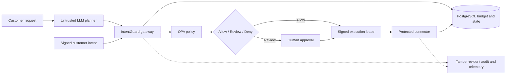

# IntentGuard

**Runtime governance for financial AI agents**

> Built a policy-enforcement gateway that constrains autonomous financial
> agents with signed customer intent, dynamic budget reservations, human
> approval, short-lived execution leases, and tamper-evident audit logs.


## Two-minute overview

IntentGuard is a real-time control plane that evaluates every action proposed by
an autonomous financial agent before that action reaches a payment, servicing,
travel, or claims system.

It combines registered agent identity, registered customer intent, versioned
agent policy, dynamic spend limits, risk-based human approval, instant
revocation, a fleet kill switch, and a hash-chained audit trail. API callers are
verified with RS256 JWTs and customer intent is signed with Ed25519; see
[`docs/threat-model.md`](docs/threat-model.md).



Run the full local stack:

```powershell
./scripts/stack.ps1 up
```

Or run the complete booking lifecycle without Docker or API keys:

```powershell
.venv/Scripts/python.exe examples/travel_agent.py
```

| Evidence | Latest committed result |
| --- | ---: |
| Named correctness, security, and reliability scenarios | 44/44 passed |
| Deterministic policy acceptance controls | 31/31 passed |
| LLM containment scenarios | 12/12 passed |
| Maximum observed concurrent budget overspend | INR 0 |
| Protected connector p95 | 0.2711 ms |

Start with the [90-second demo](docs/demo-script.md),
[architecture](docs/architecture.md), [evaluation evidence](docs/evidence/evaluation-2026-08-30.md),
[deployment guide](docs/deployment.md), and [operator runbook](docs/runbook.md).

## Why this matters

Traditional API authorization answers:

> Is this agent allowed to call this API?

IntentGuard answers the stronger question:

> Is this exact action allowed for this agent, customer intent, budget, risk
> level, and point in time?

For example, a travel agent may be allowed to book flights, but a request to
purchase a non-refundable INR 31,000 ticket must still be blocked when the
customer authorized only refundable tickets below INR 18,000.

## Current milestone

The repository contains a dependency-light Python domain core and a FastAPI
governance gateway that demonstrate:

- registered-agent and action-level permissions;
- intent-bound amount, currency, and contextual constraints;
- per-action and rolling daily spend limits;
- gateway-derived risk scoring, where an agent's self-reported score may raise
  the effective risk but never lower it;
- an operator approval queue for high-risk actions;
- individual-agent revocation;
- an emergency fleet stop;
- concurrency-safe budget reservations and short-lived execution leases;
- fleet-epoch invalidation of outstanding authorizations;
- hash-chained audit events with integrity verification, including a head
  checkpoint that detects truncation of the newest events;
- a live React dashboard connected to the REST and OpenAPI contract.

Eight adversarial suites in [`tests/test_adversarial.py`](tests/test_adversarial.py)
hold those controls open against deliberate attack: intent tampering, replay
after revocation, budget time-of-check/time-of-use, a concurrent spend race,
fleet-epoch bypass, self-reported risk, cross-customer intent reuse,
and audit-chain tampering. The limits of what any of it
covers are written down in [`docs/threat-model.md`](docs/threat-model.md).

## Durable governance state

The daily cap used to be guarded by an in-process lock. That is correct in one
process and wrong in two: each replica keeps its own spend counters, so N
replicas permit N times the cap.

[`src/intentguard/budget.py`](src/intentguard/budget.py) moves that invariant
into Postgres, where every replica shares it:

```
committed + reserved + amount <= daily_budget
```

The check and the write are one statement, so there is no read-modify-write
window for replicas to race through. Under `READ COMMITTED`, a writer blocked
on a contended row re-evaluates the condition against the winner's committed
value and matches zero rows — which is the refusal we want.

```bash
createdb intentguard
psql -d intentguard -f migrations/0001_budget_ledger.sql
psql -d intentguard -f migrations/0002_governance_state.sql
psql -d intentguard -f migrations/0003_signed_intents.sql
psql -d intentguard -f migrations/0004_protected_connector.sql
psql -d intentguard -f migrations/0005_policy_as_code.sql
export INTENTGUARD_DATABASE_URL=postgresql:///intentguard
```

When `INTENTGUARD_DATABASE_URL` is set, the API constructs the PostgreSQL
budget ledger, governance repository, and audit ledger automatically. With no
URL it retains the dependency-free in-memory defaults for demos and tests:

```python
engine = PolicyEngine(
    budget_ledger=PostgresBudgetLedger(database_url),
    state_repository=PostgresStateRepository(database_url),
    audit_ledger=PostgresAuditLedger(database_url),
)
```

The second migration stores agent policies, customer intents, approvals,
authorization/idempotency records, leases, revocation epochs, fleet state,
velocity counters, and audit events/checkpoints. Reservations remain in the
first migration because their atomic budget invariant is enforced there.

## Signed customer intent

Customer consent is represented by an Ed25519-signed `IntentPassport`. The
signature covers the intent/customer/agent IDs, action, maximum amount,
currency, constrained attributes, issuer, audience, issue/not-before/expiry
times, nonce, and key ID. The gateway verifies every signed field before it
stores the intent and atomically consumes `(issuer, nonce)`, so the same consent
artifact cannot be registered twice.

Admins rotate consent-service public keys through `POST /v1/intent-keys` and
revoke an old key through `POST /v1/intent-keys/{key_id}/revoke`. PostgreSQL
stores keys and consumed nonces when durable mode is enabled. Run
`python examples/sign_intent_passport.py` for a fully offline signing example.

## Protected booking connector

Allowed authorizations include an Ed25519-signed execution capability binding
the lease, request, reservation, agent, action, amount, currency, fleet epoch,
time window, issuer, audience, and key ID. The standalone connector verifies it
locally, rechecks fleet state, enforces idempotency, and only then contacts its
provider and commits the reservation.

Start it with `intentguard-booking-connector` (port 8100 by default). Direct
requests without a signed lease receive `401`; tampering and stale leases are
refused; identical retries return the cached provider response; and provider
timeouts or failures release the budget hold.

## Versioned policy-as-code

Declarative authorization rules now live in
[`policies/authorization.rego`](policies/authorization.rego) and execute through
the official OPA CLI. Python remains responsible for authenticated state,
risk derivation, atomic budget reservations, approvals, and lease issuance.
The operator API supports Rego validation, side-effect-free dry runs, drafts,
publish, behavioral comparison across test inputs, and rollback. Published
versions are stored in PostgreSQL by migration `0005`; local runs use the same
repository contract in memory. Install the pinned, checksum-verified OPA CLI
and run the native policy matrix with:

```powershell
.\scripts\install-opa.ps1
.tools\opa.exe test policies --verbose --fail-on-empty
```

Two implementations satisfy one protocol, and the same contract tests run
against both: `InMemoryBudgetLedger` for single-process runs, and
`PostgresBudgetLedger` for anything with more than one replica.

[`tests/test_budget_ledger.py`](tests/test_budget_ledger.py) proves the
difference with real OS processes rather than threads, because no thread-based
test can show a cross-process bug:

| Test | Result |
| --- | --- |
| 8 replicas, per-process in-memory ledger | Cap **breached** — 12,000 against 10,000, as expected |
| 8 replicas, shared Postgres ledger | Cap held — exactly 9,000 reserved, over 12 repeated races |
| 8 replicas, full `PolicyEngine` each, shared ledger | Cap held — exactly 9,000 committed, losers denied cleanly |

The suite skips the Postgres tests when no database is reachable, so a clone
with no Postgres still runs everything else.

The governance repository contract is also tested across two engine instances:
a lease issued by instance A can be committed by B, fleet stops propagate, and
revocations, approvals, and idempotent results survive reconstruction.

## Conversational agent

A customer can talk to the agent instead of hand-crafting an action. The agent
turns a message into a *proposed* action; it never decides anything. Every
proposal goes through the same policy engine as any other request.

Talk to it from a terminal, no server and no API key required:

```bash
PYTHONPATH=src .venv/bin/python examples/chat.py
```

Or over HTTP once the demo is running:

```bash
curl -X POST http://127.0.0.1:8000/v1/agent/message \
  -H 'Content-Type: application/json' \
  -d '{"message":"book a non-refundable hotel for 9000",
       "customer_id":"demo-customer","agent_id":"agt_travel_01"}'
```

```
DENY - IntentGuard refused book hotel for 9000 INR. The request violates the
authorized 'refundable' constraint: expected True, received False.
```

The model sits on the untrusted side of the boundary, deliberately:

- `agent_id` and `customer_id` come from the caller, never from model output.
- The model may only cite intents that already belong to that customer. The
  tool schema constrains it to those ids and the proposal is re-checked before
  the engine sees it.
- A declared `risk_score` can only raise the effective risk, never lower it.
- Malformed model output is explicitly refused rather than guessed at.

Prompt injection can make the model propose anything. It cannot make the engine
approve it, and `InjectedInstructionTest` in
[`tests/test_agent.py`](tests/test_agent.py) holds that open.

The provider abstraction supports OpenAI's Responses API, xAI, Groq, and a
deterministic offline fallback. Put one supported provider key in `.env`:

```bash
cp .env.example .env
# then set OPENAI_API_KEY, XAI_API_KEY, or GROQ_API_KEY
```

`.env` is gitignored; `.env.example` is committed and must stay blank. The demo
script, the `intentguard-api` console script, and `examples/chat.py` all load
`.env` automatically, and anything already exported in your shell wins over it.

The provider is inferred from its key prefix or selected with
`INTENTGUARD_LLM_PROVIDER`. Timeout, retry count, tool-call count, and model are
bounded by the settings documented in `.env.example`. Model output must pass a
strict Pydantic proposal schema, may invoke only the proposal tool, and never
executes an action directly. Each turn records a stable conversation trace ID,
provider/model and prompt versions, latency, attempts, token usage, and
operator-configured cost estimates without storing the raw prompt.

Without any key the agent falls back to a deterministic scripted planner, so a
fresh clone demos end to end and CI runs the same governance path with no key
and no network.

Run the repeatable LLM containment baseline and write its JSON evidence:

```bash
intentguard-llm-eval --output docs/evidence/llm-evaluation.json
```

The checked-in dataset covers valid requests, prompt and indirect injection,
ambiguity, currency and amount handling, unsupported actions, cross-customer
intent references, override attempts, and multi-turn attacks.

Run the complete hotel-booking lifecycle offline:

```bash
python examples/travel_agent.py
```

The script uses one demo customer to show a direct booking, a booking that
requires human approval, two policy denials, and a provider failure that
releases its budget reservation. The protected mock connector in
[`examples/mock_booking_connector.py`](examples/mock_booking_connector.py)
refuses requests without matching authorization artifacts and records its
success or failure in the audit chain.

If the provider rejects the call, the agent reports the error and proposes
nothing rather than failing open. No proposal means no authorization.

## Authentication and identity

Every `/v1` endpoint now requires an RS256 bearer token (only `/health` is
public). The gateway loads public keys from a cached JWKS endpoint and validates
the key ID, signature, issuer, audience, expiration, and not-before time. Roles
are `customer`, `agent`, `operator`, `reviewer`, and `admin`; Keycloak
`realm_access.roles` claims are supported.

For an entirely local demonstration, start the loopback-only development
issuer in another terminal:

```bash
python examples/local_jwks_server.py
```

Mint a 15-minute admin token with the printed `/token` endpoint, then send it
as `Authorization: Bearer <token>`. The local issuer deliberately has no user
database and must never be exposed beyond loopback. Configure a real identity
provider with `INTENTGUARD_JWT_ISSUER`, `INTENTGUARD_JWT_AUDIENCE`, and
`INTENTGUARD_JWKS_URL` outside local development.

The one-command `scripts/start-demo.sh` and `scripts/start-demo.ps1` launch this
issuer and protected connector automatically and mint separate short-lived
agent, operator, reviewer, connector, and admin tokens, preserving separation
of duties.

Identity-sensitive values no longer come from request bodies. Agent and
customer IDs are checked against token claims, policy audit events use the
verified operator subject, and approval events use the verified reviewer
subject. A token subject cannot approve or reject a request it submitted.

## Production architecture and current prototype

The listed challenge technologies are examples rather than requirements. We are
using one coherent production path instead of attempting to use every suggested
product. The dashboard labels components as either running now or roadmap so
the prototype does not overstate its implementation.

| Layer | Selected technology | Responsibility |
| --- | --- | --- |
| Operator UI | React 19, TypeScript, Next.js 16 on Vite | Policies, budgets, fleet controls, activity, and audit review |
| Governance API | FastAPI, Python | Enforcement gateway and operator APIs |
| Policy decisions | Open Policy Agent, Rego | Granular permission and contextual policy evaluation |
| Durable state | PostgreSQL | Agents, policies, budgets, approvals, authorizations, leases, revocations, fleet state, and audit metadata |
| Ephemeral coordination | Redis | Atomic distributed rate windows; future notifications and cache/lock acceleration; never the source of truth |
| Monitoring | OpenTelemetry, Prometheus, Grafana, Tempo | Traces, latency, decisions, policy failures, and fleet health |
| Enterprise export | Splunk-compatible HTTP event export | Optional downstream security and audit integration |
| Local runtime | Docker Compose | Reproducible end-to-end prototype |
| Deployment path | AWS | ECS/Fargate, RDS, ElastiCache, and managed secrets |

The current executable prototype uses React and Next.js built and served by
`vinext` (a Vite-based drop-in replacement for the Next.js CLI), FastAPI,
OPA/Rego policy decisions, Python stateful authorization orchestration, and
selectable in-memory/PostgreSQL state. OpenTelemetry traces, Prometheus metrics,
structured JSON logs, and the Grafana/Tempo monitoring stack are implemented.
The reproducible Docker Compose stack now includes the gateway, PostgreSQL,
Redis, OPA, Keycloak, protected connector, migrations, seed job, monitoring,
and frontend. An ECS/Fargate CloudFormation target is included; a live AWS
deployment still requires account-specific networking, secrets, and authority.

Start the complete production-like local stack with:

```bash
docker compose up --build -d --wait
```

See [`docs/deployment.md`](docs/deployment.md) for service URLs, local identity
credentials, teardown/reset commands, and the AWS deployment path.

To run only the monitoring stack alongside host processes:

```bash
docker compose -f docker-compose.observability.yml up -d
```

Grafana is available at `http://127.0.0.1:3002` with a provisioned operational
dashboard. See [`docs/observability.md`](docs/observability.md) for metric,
trace, log, and local-stack details.

Verified agent, customer, operator, and connector identities also receive
separate sliding-window limits. Redis makes these limits atomic across replicas;
offline demos use the same algorithm in process. Body-size limits,
reservation/approval capacity bounds, cursor-paginated audit reads, append-only
archive policy, dependency timeouts, and connector circuit breaking are
documented in [`docs/abuse-controls.md`](docs/abuse-controls.md).

### Security guarantees and known limits

The implemented controls authenticate callers, bind signed consent to one
customer/agent/action envelope, reserve budget atomically, derive risk outside
the model, require independent review when routed, bind connector execution to
a signed short-lived lease, invalidate old leases on revocation or fleet stop,
and expose a hash-chained audit checkpoint. Configured identity, policy,
database, rate-limit, and connector dependencies fail closed.

This prototype is not a bank production deployment. Local keys and Keycloak
credentials are demonstration material; signing keys are not held in a managed
KMS/HSM; the mock hotel provider is not a financial network; audit events are
not yet exported to immutable external storage; the AWS template requires an
account, network, identity provider, and secrets; and the committed performance
figures are local baselines rather than an SLO. The complete boundary is in
[`docs/threat-model.md`](docs/threat-model.md).

## Challenge task coverage

| Required task | IntentGuard implementation |
| --- | --- |
| Granular agent permissions | Live versioned agent-policy editor plus deterministic runtime enforcement |
| Dynamic spend caps | Concurrency-safe reserve/commit/release lifecycle with live budget editing |
| Revocation and emergency stop | Per-agent revocation epochs and a fleet-wide kill switch |
| Operator dashboard | Live React console for policy, budgets, approvals, fleet controls, and audit |
| Accuracy, latency, and auditability | 31-control acceptance suite, measured HTTP round-trip and in-process engine latency, concurrency tests, and a hash-chained audit trail with a truncation-detecting head checkpoint |

## Quick start

Requires Python 3.10 or newer (the pinned FastAPI, Starlette, and Uvicorn
releases require it), Node.js 22.13 or newer, and pnpm. Start the full demo
with one command:

```bash
./scripts/start-demo.sh
```

Open the local URL printed by `vinext`, normally `http://localhost:3000`. It
connects to the API at `http://127.0.0.1:8000` and initializes a deterministic
three-agent sandbox.
Interactive API documentation is available at `http://127.0.0.1:8000/docs`.

On Windows PowerShell:

```powershell
.\scripts\start-demo.ps1
```

Run every backend and frontend check with:

```bash
./scripts/test-all.sh
```

The Windows equivalent is `.\scripts\test-all.ps1`.

Generate reproducible acceptance, in-process engine latency, concurrency, and
audit evidence with:

```bash
PYTHONPATH=src .venv/bin/python -m intentguard.benchmark
```

To start the API on its own from Windows PowerShell, resolve the interpreter
first so the commands work whichever layout `venv` produced:

```powershell
python -m venv .venv
$Python = @('.venv\Scripts\python.exe', '.venv\bin\python.exe') |
    Where-Object { Test-Path $_ } | Select-Object -First 1
& $Python -m pip install -e ".[api,dev]"
& $Python -m unittest discover -s tests -v
& $Python -m uvicorn intentguard.api:app --reload
```

Then open `http://127.0.0.1:8000/docs`. The shared frontend contract is in
[`docs/api-contract.md`](docs/api-contract.md).

### Example authorization request

The token establishes `agent_id` and `customer_id`; matching body fields do not
override those verified claims.

```bash
curl -X POST http://127.0.0.1:8000/v1/actions/authorize \
  -H "Authorization: Bearer <agent-jwt>" \
  -H "Content-Type: application/json" \
  -d '{
    "request_id":"booking-1042",
    "agent_id":"agt_travel_01",
    "action":"book_hotel",
    "amount":"4500",
    "currency":"INR",
    "intent_id":"intent_travel_booking",
    "risk_score":20,
    "attributes":{"refundable":true}
  }'
```

An allowed result contains a held reservation and signed lease. A request above
the signed intent ceiling returns a policy result—not an unhandled error. This
is the abridged denied result:

```json
{
  "decision": {
    "request_id": "booking-1042",
    "decision": "deny",
    "findings": [{
      "code": "INTENT_AMOUNT_EXCEEDED",
      "message": "The amount exceeds the customer intent limit.",
      "blocking": true
    }],
    "remaining_daily_budget": "100000",
    "policy_version": "2026.07"
  },
  "reservation": null,
  "lease": null
}
```

A high-risk request returns `"decision":"review"`, finding
`HUMAN_APPROVAL_REQUIRED`, and no execution lease. A separate reviewer must
approve it before the gateway reserves budget and issues fresh authority.

The API accepts the operator-console origins on ports 3000, 3001, and 5173 by
default. For deployed environments, set a comma-separated allowlist:

```bash
export INTENTGUARD_CORS_ORIGINS="https://operator.example.com"
```

```powershell
$env:INTENTGUARD_CORS_ORIGINS="https://operator.example.com"
```

Submission resources:

- [`docs/threat-model.md`](docs/threat-model.md) — what IntentGuard defends against, and what it explicitly does not
- [`docs/prototype-readiness.md`](docs/prototype-readiness.md) — critical-gap coverage and final checklist
- [`docs/api-contract.md`](docs/api-contract.md) — live frontend/backend contract

## Demo scenarios

Run the worked example against the in-process engine:

```bash
PYTHONPATH=src .venv/bin/python examples/demo.py
```

[`examples/demo.py`](examples/demo.py) registers one travel agent and one
customer intent, then evaluates four actions:

1. A compliant refundable INR 16,000 booking is allowed and recorded as spend.
2. An INR 31,000 booking is denied for breaching the agent's per-action limit,
   the customer's authorized maximum, and the remaining daily budget.
3. A booking with a risk score of 82 is routed to human review.
4. After the operator triggers the fleet emergency stop, a further booking is
   denied.

The script then prints whether the hash-chained audit ledger still verifies.

Lease revocation, protected-connector rejection, and live policy edits are
exercised by the test suite and the operator console rather than by this
script.

## Measured performance

Every figure below is copied from
[`docs/evidence/benchmark-2026-08-22.txt`](docs/evidence/benchmark-2026-08-22.txt),
the unedited output of a single benchmark run.

### End-to-end HTTP, under concurrent load

This is what a caller actually experiences: TCP, HTTP parsing, request
validation, the full authorization path, and JSON serialization, measured
against a real Uvicorn server at 16 concurrent clients.

| Metric | Value |
| --- | --- |
| Authorization latency, p50 | 6.85 ms |
| Authorization latency, p95 | 9.62 ms |
| Authorization latency, p99 | 13.59 ms |
| Slowest request | 17.13 ms |
| Throughput | 2,002 requests/second at concurrency 16 |

### Policy engine, in process

The engine on its own, with no transport. Useful for showing that policy
evaluation is not the bottleneck; **not** a figure to quote as system latency.

| Metric | Value |
| --- | --- |
| Decision latency, p50 | 0.0145 ms |
| Decision latency, p95 | 0.0163 ms |
| Decision latency, p99 | 0.0207 ms |
| Throughput | 70,637 decisions/second, single-threaded |

### Correctness under load

| Metric | Value |
| --- | --- |
| Concurrency test | 20 simultaneous INR 2,000 requests against an INR 10,000 daily cap: 5 allowed, INR 10,000 reserved, 0 overspend violations |
| Acceptance suite | 31 of 31 controls passed across 10 categories |
| Audit chain | Verified, including the head checkpoint |

Reproduce with:

```bash
PYTHONPATH=src .venv/bin/python -m intentguard.benchmark
```

### Unified evaluation harness

Step 11's evaluation runner turns the correctness, attack, outage, and
performance matrix into one reproducible artifact. It executes 44 named
unittests across correctness, security, and reliability; incorporates the 31
acceptance controls and 12 deterministic LLM-containment cases; and measures
policy, concurrent authorization, signed connector, approval-queue, throughput,
and budget-race behavior.

```bash
intentguard-evaluate \
  --output-json docs/evidence/evaluation.json \
  --output-markdown docs/evidence/evaluation.md
```

The committed run is available as
[`docs/evidence/evaluation-2026-08-30.md`](docs/evidence/evaluation-2026-08-30.md),
with machine-readable details in the adjacent JSON file. Database contention
stays isolated in the PostgreSQL multiprocess contract suite: the harness will
not accidentally load-test a database merely because its URL is present.

Hardware and runtime for the committed run: Apple M3 (8 cores, 4 performance
and 4 efficiency), 16 GB RAM, macOS 26.2, CPython 3.12.2. The benchmark records
its own environment block, so a re-run on different hardware is self-labelling.

Caveats worth reading before quoting any of this:

- The two latency tables are three orders of magnitude apart because they
  measure different things. Concurrency of 16 on 8 cores means requests queue,
  which is why per-request latency is higher than the single-threaded engine
  figure while throughput stays flat.
- The HTTP measurement runs against isolated probe state on loopback. It does
  not include a remote JWKS fetch, TLS termination, or production network
  latency.
- p99 degrades over longer runs: at 2,000 requests it roughly doubles, because
  held reservations accumulate and are scanned on each authorization. Nothing
  evicts them until they expire.
- These benchmark numbers use isolated in-memory state; they do not measure the
  PostgreSQL backends or network/database latency.

## Project structure

```text
.
├── .github/workflows/ci.yml     # Backend and frontend checks on every push
├── LICENSE                      # MIT
├── docs/
│   ├── api-contract.md          # REST contract shared with the console
│   ├── architecture.md
│   ├── build-plan.md
│   ├── context.md
│   ├── evidence/                # Committed raw benchmark output
│   ├── prototype-readiness.md
│   ├── repo-metadata.md         # Repository description and topics
│   └── threat-model.md          # Defences, non-defences, trust boundaries
├── examples/
│   ├── chat.py                  # Interactive governed-agent REPL
│   └── demo.py                  # Four-scenario worked example
├── prototype/                   # Operator console (React, Next.js, vinext)
│   ├── app/                     # layout.tsx, page.tsx, globals.css
│   ├── build/                   # sites-vite-plugin.ts
│   ├── db/                      # Drizzle schema and client
│   ├── lib/intentguard-api.ts   # Typed client for the governance API
│   ├── public/
│   ├── tests/rendered-html.test.mjs
│   ├── worker/index.ts          # Cloudflare worker entry point
│   └── vite.config.ts
├── scripts/
│   ├── start-demo.sh            # and start-demo.ps1
│   └── test-all.sh              # and test-all.ps1
├── src/
│   └── intentguard/
│       ├── __init__.py          # Public package surface
│       ├── agent.py              # Grok-backed agent, scripted fallback
│       ├── api.py               # FastAPI governance gateway
│       ├── config.py            # .env loading, stdlib only
│       ├── audit.py             # Hash-chained audit ledger
│       ├── budget.py            # Durable budget ledger (in-memory + Postgres)
│       ├── benchmark.py         # Acceptance, latency, and race evidence
│       ├── models.py            # Domain models
│       └── policy_engine.py     # Runtime policy evaluation
└── tests/
    ├── test_adversarial.py      # Eight attack classes against the real engine
    ├── test_agent.py            # Governed agent, including prompt injection
    ├── test_api.py
    ├── test_authorization_flow.py
    ├── test_benchmark.py
    ├── test_budget_ledger.py
    ├── test_config.py
    └── test_policy_engine.py
```

## Contribution split

The repository history records contributions from Manan Sethi and Ratnam Ojha.
For portfolio presentation, the work is grouped into two reviewable streams:

| Contributor | Primary stream |
| --- | --- |
| Manan Sethi | Authentication/authorization, persistent and distributed state, deployment, and observability |
| Ratnam Ojha | LLM planner/evaluation, policy authoring, connector integration, dashboard, demo, and documentation |
| Both | Architecture decisions, threat-model review, pull-request review, and end-to-end verification |

Git history remains the source of truth for individual changes. See
[`CONTRIBUTING.md`](CONTRIBUTING.md) for review expectations.

## Product roadmap

### Round 1: idea submission

- Architecture and problem framing
- Distinctive intent-bound authorization story
- Measurable business and risk outcomes
- Credible prototype plan

### Prototype

Running on `main`:

- FastAPI governance gateway
- React and TypeScript operator console
- Three seeded agents: travel, servicing, and benefits
- Human approval queue
- Live fleet status, audit review, and JSON evidence export in the console
- PostgreSQL durable governance state and audit ledger
- Ed25519-signed intent passports with rotation and replay protection
- Protected booking connector with signed leases and durable idempotency

The local production-like stack also packages OPA and Redis alongside the
gateway, connector, PostgreSQL, Keycloak, and observability services.

### Advanced differentiators

- Scoped agent credentials and consent-service KMS integration
- Delegation lineage for multi-agent workflows
- Velocity and anomaly-based dynamic budgets
- Shadow-mode policy testing
- Counterfactual and adversarial policy tests
- Merkle-backed audit checkpoints

## License

MIT. See [`LICENSE`](LICENSE).
