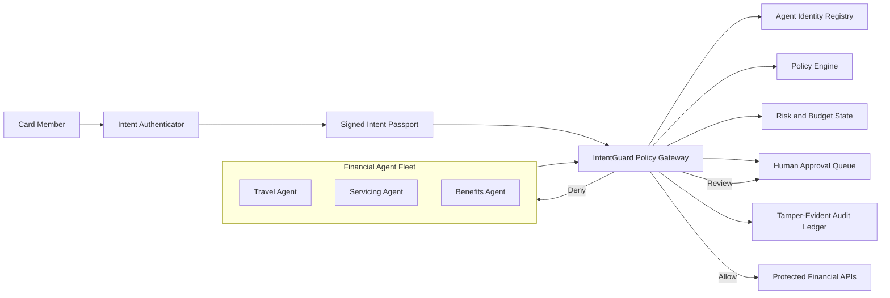

# IntentGuard architecture

## System context

IntentGuard sits between autonomous agents and financial tools. Agents never
call protected systems directly.

## Evaluation sequence

## Decision contract

Every evaluation returns:

- outcome: `allow`, `deny`, or `review`;
- stable policy finding codes;
- a plain-language explanation;
- remaining budget;
- the applied policy version;
- a hash-chained audit event.

## Trust boundaries

1. Agent output is always untrusted input.
2. Customer intent must be independently authenticated.
3. The policy engine is deterministic for the same inputs and state.
4. An LLM may help interpret intent, but cannot bypass policy enforcement.
5. Protected APIs accept requests only from the governance gateway.
6. Revocation and the emergency stop are checked at evaluation time.

## Prototype evolution

The current implementation keeps state in memory for fast iteration. The
prototype will replace this with:

- PostgreSQL for agents, intents, policies, and approvals;
- Redis for low-latency budgets, counters, and revocation state;
- OPA or Cedar for externally configurable policy-as-code;
- an append-only event store for audit history;
- FastAPI for the governance gateway;
- React for the operator and reviewer interfaces.

