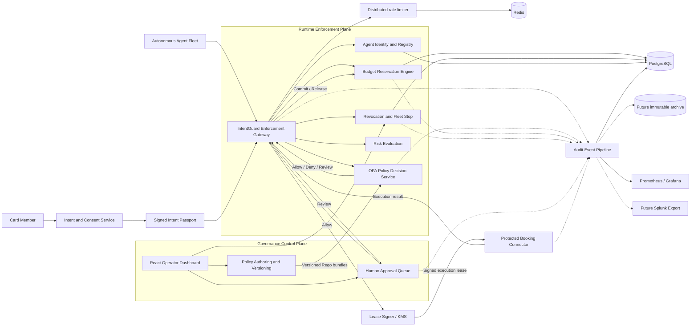
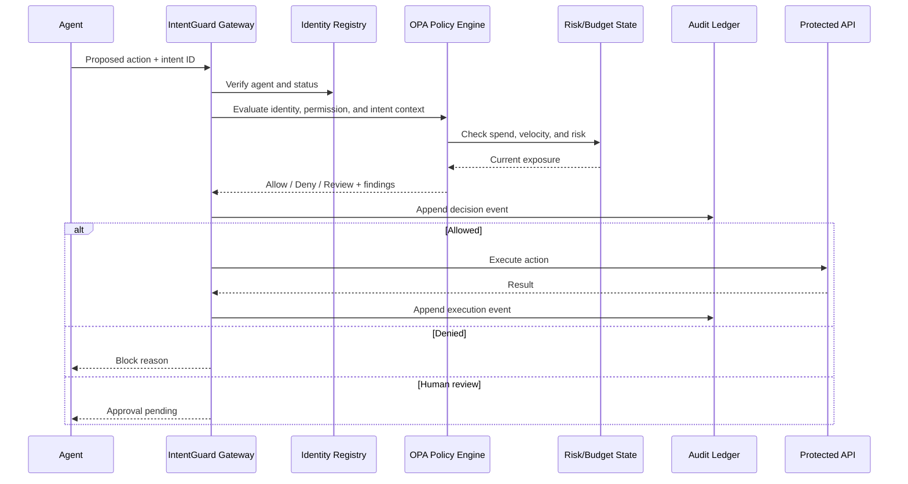

# IntentGuard architecture

This diagram is the target production architecture. The executable system now
implements FastAPI, OPA/Rego declarative decisions, Python authorization orchestration, PostgreSQL repositories,
and Ed25519-signed intent passports with rotating public keys and durable nonce
replay protection, OpenTelemetry tracing, Prometheus metrics, structured JSON
logs, a Redis-backed distributed rate limiter, and a provisioned Grafana/Tempo
stack. KMS-managed private keys, immutable external audit archive, and Splunk
export remain roadmap components.

## System context

IntentGuard sits between autonomous agents and financial tools. Agents never
call protected systems directly. The core architecture fulfills the five
challenge tasks; intent passports, human approval, and execution leases are
differentiators layered on top.

## Evaluation sequence

## Mandatory task-to-component mapping

### 1. Granular permission model

- Agent registry stores identity, owner, status, environment, and capability
  grants.
- Rego policies evaluate action, resource, amount, merchant category, region,
  time window, delegation scope, and customer intent.
- The gateway fails closed if identity or policy evaluation is unavailable.

### 2. Dynamic spend caps

- PostgreSQL stores budget definitions and durable reconciliation data.
- PostgreSQL performs atomic reservation, commit, and release operations.
- Supported scopes include per action, per agent, shared fleet, customer, and
  rolling time window.
- Reservations prevent concurrent agents from collectively overspending.

### 3. Revocation and emergency stop

- PostgreSQL stores per-agent revocation epochs and fleet-stop state; Redis is
  reserved for future propagation acceleration, never authoritative state.
- Every request checks current revocation state before execution.
- Short-lived Ed25519-signed leases carry request, reservation, action, amount,
  currency, and fleet epoch so connectors reject tampering and stale authority.

### 4. Operator dashboard

- Configure and version policies.
- Assign permissions and budgets.
- Observe agent health, decisions, and spend.
- Approve or reject high-risk actions.
- Revoke one agent or stop the fleet.
- Search and replay audit events.

### 5. Testing and optimization

- Unit tests cover individual policies and boundary conditions.
- Integration tests cover gateway, OPA, Redis, PostgreSQL, and connectors.
- Load tests measure p50, p95, and p99 policy-enforcement latency.
- Adversarial tests cover bypass attempts, stale leases, races, and outages.
- Audit verification confirms completeness and hash-chain integrity.

## Decision contract

Every evaluation returns:

- outcome: `allow`, `deny`, or `review`;
- stable policy finding codes;
- a plain-language explanation;
- remaining budget;
- the applied policy version;
- a hash-chained audit event.

## Trust boundaries

1. Agent output is always untrusted input.
2. Customer intent must be independently authenticated.
3. The policy engine is deterministic for the same inputs and state.
4. An LLM may help interpret intent, but cannot bypass policy enforcement.
5. Protected APIs accept requests only from the governance gateway.
6. Revocation and the emergency stop are checked at evaluation time.

## LLM proposal boundary

`GovernedAgent` depends on one planner protocol. The OpenAI Responses adapter,
xAI/Groq chat-completions adapter, and deterministic fallback all return the
same validated proposal type. Provider responses are constrained to one
allowlisted proposal tool, parsed through a strict Pydantic schema, and bounded
by timeout, retry, and tool-call limits. The model never receives an execution
tool and never determines the policy decision.

Safe per-turn telemetry carries a stable conversation trace ID, model and
prompt versions, attempts, token counts, latency, and operator-configured cost
rates. Raw prompts are replaced by a SHA-256 fingerprint and common secrets and
identifiers are redacted from error telemetry.

## Prototype evolution

The current implementation provides repository interfaces with in-memory and
PostgreSQL implementations. PostgreSQL stores agents, intents, policies,
approvals, authorizations, leases, revocations, fleet state, budget records,
counters, and audit metadata. In-memory implementations remain for fast tests.
The remaining evolution is:

- expand the implemented Redis rate limiter to expiry notifications and
  coordination that is never authoritative state;
- move the hash-chained audit stream into immutable external archive storage;
- move signing keys from process configuration to a managed KMS/HSM boundary.
